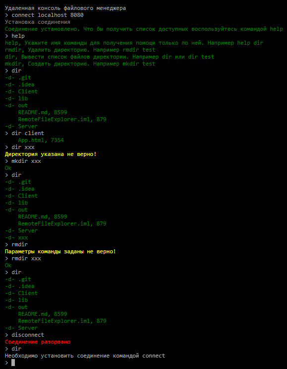

# Файловый менеджер через удаленный доступ
Клиент-серверное приложение, предотставляющее доступ к командам файловой системы 
в виде эмуляции консоли реализованной как web страница. 

В качества примера реализованы такие команды как dir, mkdir и т.д.

## Архитектура
Архитектура решения представляет из себя клиент-серверное приложение, где в качестве транспорта 
между клиентом и сервером используется http протокол WebSocket. 
Данные обмена является текст формата json, двух видов:
* Запрос, с полями id, body
* Ответ, с полями request_id, result_type, result_body        

##### [Сервер](Server/src/com.remotefileexplorer) файлового менеджера
 
При старте сервера через параметры указывается 
_рабочая директория_, 
_уровень доступа (чтение или запись)_, 
_порт_ http соединения.

Затем подымается [WebSocket сервер](Server/src/com.remotefileexplorer/transport/Server.java), который слушает указанный порт 
и в случае получания [команд](Server/src/com.remotefileexplorer/command) от клиента пытается их выполнить.

##### [Клиент](Client/App.html) файлового менеджера

Клиентская часть решения релизована в виде [web страницы](Client/App.html) эмулирующая консоль.
Использовалось внешнее решение [jQuery Terminal Emulator Plugin](https://terminal.jcubic.pl).
   
## Пример работы

